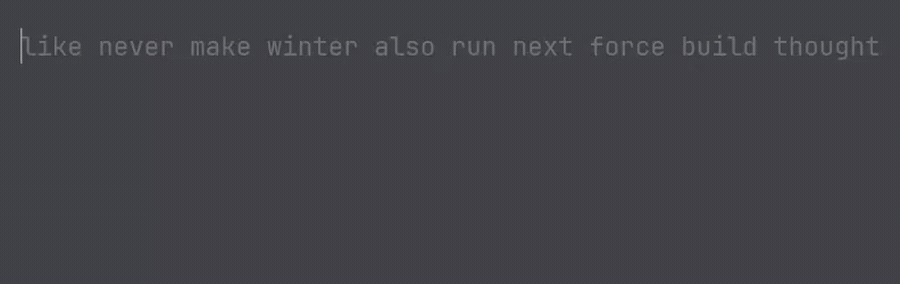

# burst-typing

A low-latency desktop typing test for short bursts, written in Java 21 and JavaFX. Captures
every keystroke with nanosecond timestamps to report digraph latency and run-to-run
distribution instead of a single WPM number.



## Why

Browser-based typing tests accumulate noticeable input lag at high speeds. At ~200 wpm a
10-word test finishes in under three seconds, so keystroke-to-pulse latency and timing
precision stop being background noise and start dominating the result — a 50 ms error is
~2% of the entire run.

That cuts two ways, and this project takes both seriously. First, get the browser out of the
input path: a native window and one `Text` node per character, so a keystroke restyles exactly
one node. Second, stop pretending a single run's WPM means anything. Ten words is a small
enough sample that variance swamps skill, so the app reports where a run sits against recent
history, and which specific finger transitions are actually slow.

## How it works

Tests are always 10 words, drawn from a curated 303-word list (2–8 characters, ~58 keystrokes
per test). The short format is the whole point rather than a default — it's what makes timing
precision matter. On each run:

1. Every keystroke is recorded as `(typed char, expected char, target index, System.nanoTime())`.
   The clock starts on the first keystroke, not when the test loads, so idle time isn't counted.
2. The log is **append-only**. Backspace moves the cursor but deletes nothing, so a correction
   leaves both the mistake and the fix in the record — which is what makes raw WPM (every
   keystroke) and net WPM (correct ones only) separable rather than two views of one number.
3. On completion the run is written to `~/.burst-typing/runs.json` via a temp-file-then-move,
   so a crash mid-write leaves the previous history intact rather than a truncated file.
4. Digraph latencies are recomputed over the last 20 runs: the median gap between consecutively
   typed correct character pairs, with the three slowest shown. A pair needs 5 samples before
   it's reported at all.

Press **TAB** for a new test, **F1** for the input-latency overlay.

## Measured latency

Keystroke-to-pulse, measured in-app over 1,048 samples: **p50 2.5 ms, p95 4.4 ms, p99 5.0 ms**,
plus a single 68.7 ms outlier attributable to GC.

A median near half a pulse interval and a p99 near one full interval is the signature of an
input path that is pulse-bound rather than compute-bound: the handler finishes well inside the
frame budget and spends the remainder waiting for the next pulse. The shape of the distribution
implies a ~5 ms interval on the machine this was measured on.

Measured to the post-layout pulse, not to display present, so this is a lower bound on true
end-to-end latency — it can't see the OS input stack or display scanout.

## Design decisions

- **`engine/` and `analytics/` contain zero `javafx.*` imports.** Not "mostly" — zero, and it's
  verifiable in one line. All the logic worth testing is therefore testable without spinning up
  a UI toolkit, which is why the suite runs in seconds and opens no window.

  ```bash
  grep -r javafx src/main/java/com/hudsonxm/bursttyping/engine/ \
                 src/main/java/com/hudsonxm/bursttyping/analytics/
  ```

- **Timestamps are passed in, never taken.** `TypingSession.accept(char, long)` and
  `PulseLatencyTracker.onKeystroke(long)` take a caller-supplied `nanoTime()` rather than
  calling it internally. The UI passes the real clock; tests pass fixed values and assert on
  exact nanoseconds instead of tolerances.
- **Each keystroke records the index it was typed at**, which is what keeps the digraph stats
  honest. Because backspace logs nothing, adjacency in the *log* isn't adjacency in the *text*:
  type `the`, correct it, and the log holds `…e, t…` with the correction time in between —
  a fake `et` pair, several hundred milliseconds slow, sorting straight to the top of the
  slowest list. Requiring `curr.index == prev.index + 1` rejects it. A median doesn't save you
  here: a pair that only arises by straddling a correction has *every* sample inflated.
- **The latency overlay doesn't flatter itself.** Keystrokes resolve on the next render pulse
  and several can be waiting on the same one, so the tracker buffers them and measures each from
  its own arrival. An earlier single-slot version silently kept only the last, biasing every
  percentile low during exactly the bursts the app exists to measure. Overflow is counted and
  displayed rather than dropped quietly.
- **The caret is an unmanaged `Line` in a `Group`**, not a styled character, so it can be
  positioned absolutely without joining text layout and shoving characters sideways. It reads
  logical bounds, which are identical for every glyph, so it doesn't grow and shrink over
  ascenders.

## The word list

The 303 words were built by intersecting Norvig frequency data with `/usr/share/dict/words`,
filtering to 2–8 characters, and hand-trimming what was left — dropping proper nouns, British
spellings, and awkward same-hand pile-ups. The goal is words common enough to be muscle memory,
so a slow digraph reflects the transition rather than unfamiliarity with the word.

It was deliberately not taken from monkeytype, whose word lists are GPL-3.0 and incompatible
with this repo's MIT license.

`WordListProvider` applies no length filter of its own: every non-blank line in the file is
drawn, so editing the list takes effect rather than being silently discarded.

## Testing

49 JUnit 5 tests across `engine/`, `analytics/`, and `persistence/`. No window opens.

```
./gradlew test
```

Because timestamps are injected, timing behavior is asserted exactly rather than with sleeps
or tolerances. `JsonRunStoreTest` uses `@TempDir`, so the suite never touches real run history.
The pulse-latency tests include a direct regression for the sampling bias above: three
keystrokes resolving on one pulse must produce three distinct samples, not one.

## Stack

Java 21 · JavaFX 21 · Gradle · Jackson · JUnit 5

## Running locally

```
git clone https://github.com/hudsonxm/burst-typing
cd burst-typing
./gradlew run
```

Needs a JDK 21 on the machine. Gradle itself doesn't — the wrapper is committed. JavaFX is
pulled from Maven Central by the `org.openjfx.javafxplugin` plugin, so there's no separate SDK
to install or module path to configure by hand.

JavaFX pulses at the display's refresh rate by default. To pin it to a specific rate, add the
property to `build.gradle`:

```groovy
application {
    mainClass = 'com.hudsonxm.bursttyping.App'
    applicationDefaultJvmArgs = ['-Djavafx.animation.framerate=120']
}
```

That applies to `./gradlew run` only — an IDE launch configuration starts its own JVM and won't
pick it up unless the same flag is set there.

## What's next

- **Distribution over recent runs.** The post-run line is currently best/average/count, which is
  a placeholder for the actual point of the project: showing where a run falls in its own
  distribution rather than next to a personal best.
- **Digraph pairs are pooled across all word positions.** `th` mid-word and `th` immediately
  after a space are counted as the same pair, even though one starts from rest and the other
  continues an existing motion.
- **Error clustering.** The keystroke log already holds everything needed to find *where* in a
  word mistakes happen; nothing reads it that way yet.
- **A schema version in `runs.json`.** Adding a field to `Keystroke` once already invalidated
  older history silently — Jackson defaulted the missing value, so runs still loaded and still
  counted for WPM while contributing nothing to digraph stats. There's no version field to
  detect that against.

## License

MIT — see [LICENSE](LICENSE). JetBrains Mono is bundled under the SIL Open Font License 1.1,
with its license text alongside the font in `src/main/resources/fonts/`.
